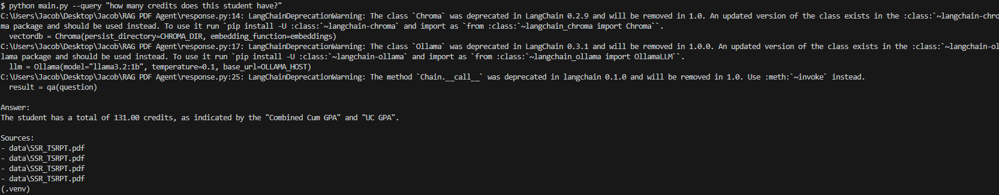

# Resume/Transcript RAG Agent
This is a prototype RAG agent that aims to answer questions about a student's
grades, coursework, or other experiences.

## Setup
1. Initialize your virtual environment and activate it

```bash
python -m venv .venv
source .venv/Scripts/activate
```

2. Install the pip packages
```bash
pip install -r requirements.txt
```

## Using the agent
Run these commands to activate Ollama
```bash
ollama serve
ollama pull llama3.2:1b
```

Query a response with these commands
```bash
python main.py --ingest
python main.py --query "your question"
```

## Sample Usage

